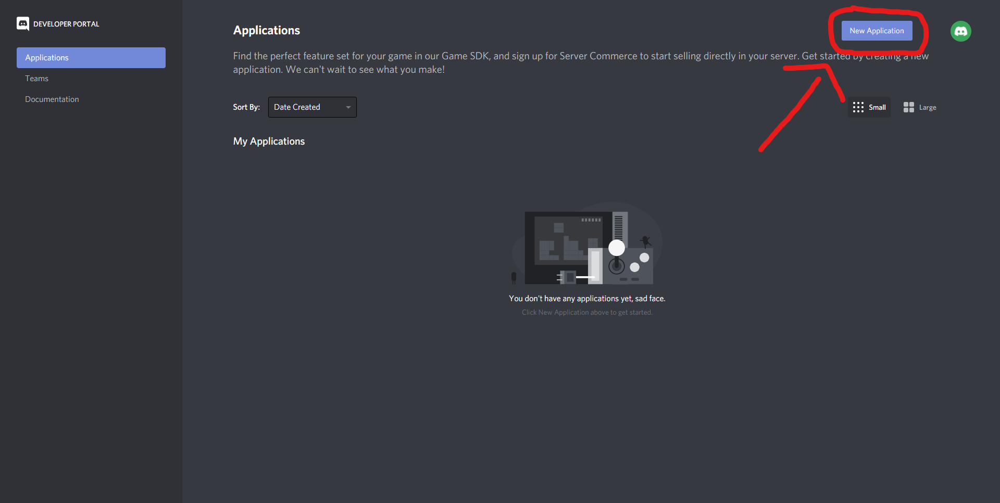
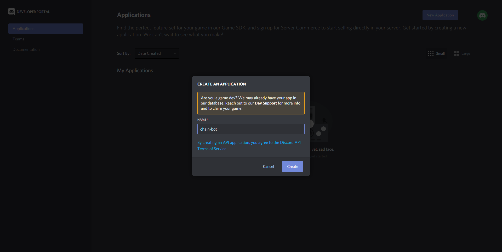
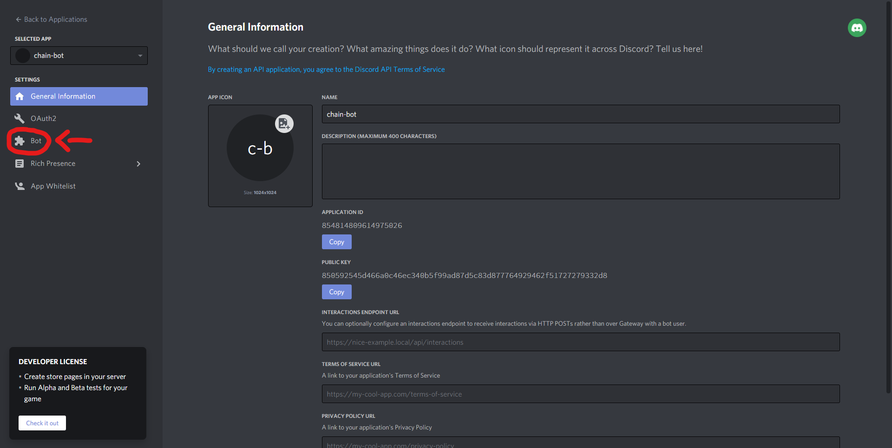
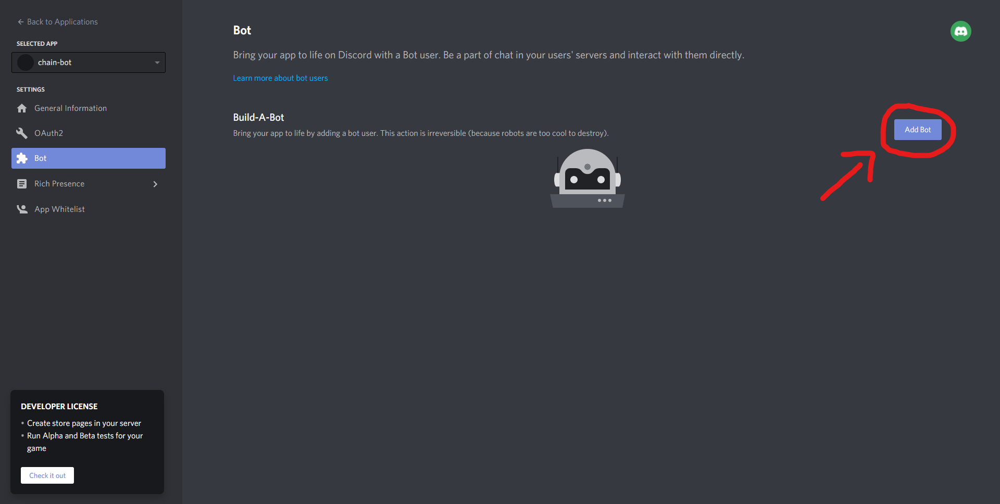
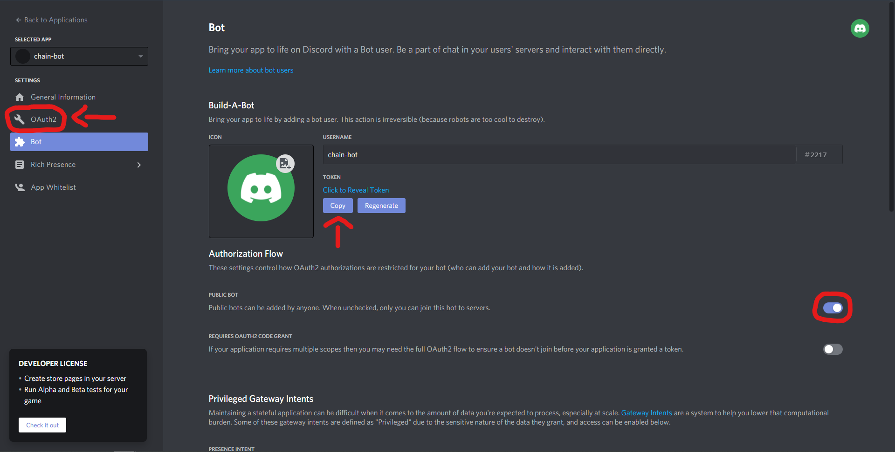
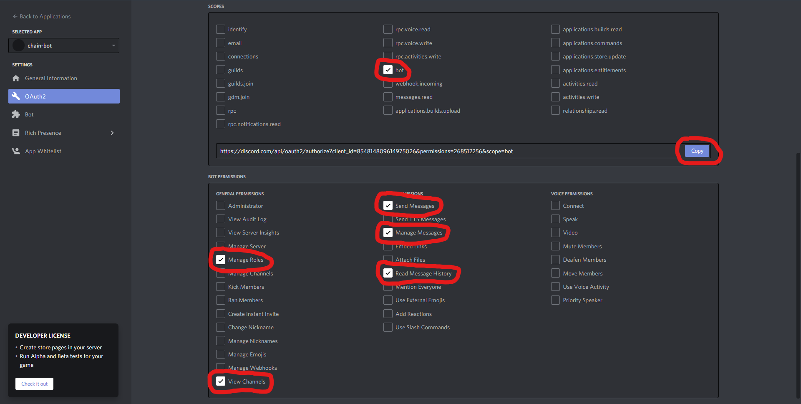

# chain-bot
A Discord bot **template** that moderates channels where only one word is supposed to be sent (aka "chains")

## Features:
* Prevents stuff like this\

* Prevents stuff like this\

* Prevents stuff like this\

* Prevents stuff like this\

* Prevents stuff like this\

* Prevents stuff like this\

* Prevents stuff like this\

###### I'm too lazy to actually explain anything
* Also auto-mutes repeat offenders

## Auto-muting:
*Auto-muting cannot be configured at the moment, so I just put what I think is most fair:*\
3 infractions: 15 minute mute\
5 infractions: 1 hour mute\
7 infractions: 6 hour mute\
9 infractions: 24 hour mute\
Every two hours while someone is not muted, their infraction count will go down by one.

## Commands:
There are no commands. The only purpose of the bot is to moderate.

## Hosting:
Since this repository is a template and not an actual bot, hosting the code on your own is recommended!

### Getting the files set up:
**With git:**\
Step 1: Open the terminal of your choice and navigate to the folder you want the files to be in\
Step 2: Clone this repository using `git clone https://github.com/Geomty/chain-bot.git`

**Without git:**\
Step 1: Press the green download button at the top of this page\
Step 2: Press the button labeled "Download ZIP" in the dropdown box and wait for the download to complete\
Step 3: Open File Explorer/Finder/whatever and navigate to the folder the zip file was downloaded in\
Step 4: Right click on the zip file and press "Extract all"\
Step 5: Choose the folder you want the files to be extracted in

*The assets folder is only nesseccary for displaying the images on this readme, you can delete it if you'd like*

### Getting the bot user set up:
Step 1: Navigate to https://discord.com/developers/applications in the browser of your choice\
Step 2: Press the button labeled "New application" in the top right corner\
\
Step 3: Name the bot whatever you want and press the blurple create button\
\
Step 4: Give your bot a nice profile picture and description if you'd like, and then press the button labeled "Bot" on the sidebar\
\
Step 5: Press the button labeled "Add bot" in the top right corner and confirm that you want to create a bot user\
\
Step 6: Press button labeled "Copy" to copy your bot's token, which is sort of a username and password combined. **Never give out your bot's token to anyone. Doing so will give that person full access to your entire bot.** *You can always come back to this page and press the button labeled "Regenerate" to generate a new token!*\
Step 7: Uncheck the circled button in the image below so nobody else can invite your bot other than you, and then press the button labeled "OAuth2" on the sidebar\
\
Step 8: Check all the checkboxes in the image below, and then press the blurple copy button. You can ignore everything else.\
\
Step 9: Paste the link in a new tab and follow the steps on-screen to invite your bot to your server (make sure to re-copy your bot's token afterwards)\
*I am not responsible for any errors the bot may cause by not selecting the appropriate permissions*

### Running the bot:
Step 1: Open your config.json file\
Step 2: Replace `your token` with what you copied earlier\
Step 3: Replace `your channel` with the ID of the channel where only one word or sentence is supposed to be sent\
*You can copy the ID of anything by enabling developer mode, which can be done by going to the section labeled "Advanced" in your user settings. After enabling developr mode, right clicking on anything will now show a new button labeled "Copy ID".*\
Step 4: Replace `your word` with the word that is only supposed to be sent in that channel\
Step 5: Replace `your shame channel` with the ID of the channel where the bot will report offenders\
Step 6: Replace `your mute role` with the ID of the role that the bot will assign to repeat offenders\
*Nothing can be disabled at the moment, so just bear with what I've provided, sorry!*\
Step 7: Download Node.js at https://nodejs.org \
Step 8: When installing, make sure npm is selected on the custom setup screen\
Step 9: When finished, open your terminal and navigate to the folder your bot's files are in\
Step 10: Run `npm install` to install all the nesseccary modules the bot needs to run\
Step 11: To run the bot, simply type in `node .` and hit enter. You'll know the bot is running when a confirmation message appears.\
Step 12: To stop the bot, run control/command + c\
Congratulations! Your bot has been fully set up!

## Contributing:
If there is an problem with your bot, or you want to suggest a new feature, simply create an issue at https://github.com/Geomty/chain-bot/issues .\
If you want to fix my messy code or add a new feature for me, you can fork this repository and create a pull request at https://github.com/Geomty/chain-bot/pulls .

###### wow you made it to the bottom